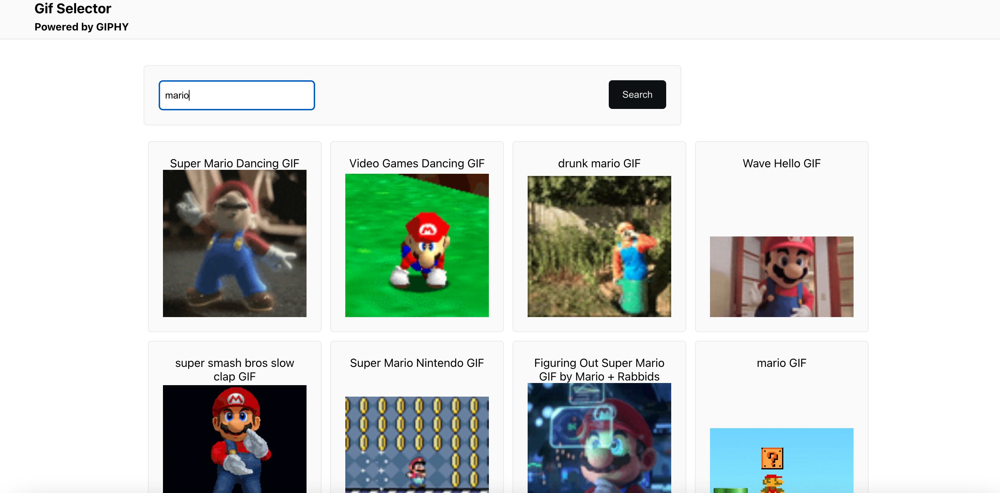
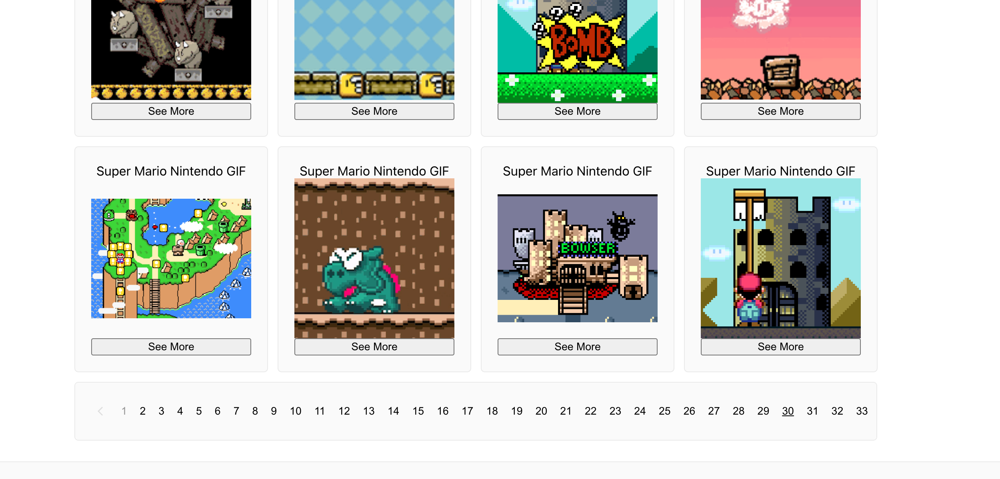

## Task - Gif Selector | Frontend-Exercise
### Coding challenge

**Description**
- Display the results as still thumbnails on the page in a layout that you find sensible.
- A large volume of results should load in a performance-minded fashion - consider
paginating your results in any form you’d like
- Clicking on a thumbnail should launch a modal which allows the user to browse
through individual GIF renditions (https://developers.giphy.com/docs/api/schema/
#image-object). The renditions in this view should be fully animated
- Provide a way for the user to perform a keyword search against the API

**Requirements**
- Use ReactJS to complete the challenge
- Make sure the solution works
- Create a minimalistic but sensible UX
- You are allowed to use any dependencies, including UI libraries, but make sure your
choice is justified
- Your code should be readable, maintainable, and production-ready
- Your work will be reviewed in Chrome/a Chromium-based browser, so test
accordingly
- Provide the solution via a GitHub repo, or a CodeSandbox
- Leave any notes you might have in a README.md file in the root of the repo
- Specify how much time approximately it took you to complete the challenge

**Nice to have**
- Unit and/or e2e testing
- Strictly typed codebase (consider using Typescript or Flow)

[Alvaro Hernandez](mailto:alvarohernandezassens@gmail.com)

## Proposed Solution

- Setup client with create-react-app
- Create basic component structure and design state workflow
- Implement state system with props
- Implement styes with styled-components
- Refine logic and fix bugs
- Setup Jest and add tests

## Time
- 4 or 5 hours during Saturday
- 1 hour on Sunday to fix bugs
## Screenshots

## Libraries / Tools Used

- React.js
- Create React App for project setup
- Typescript
- Styled Components
- React Icons
- Jest

## Frontend Setup

To install the dependencies run in the folder:

`npm install` or `yarn install`

Place the API key in a .env file as REACT_APP_GIPHY_KEY, see `.env.example` for reference.

And to run the app:

`npm start` or `yarn start`

## Running the tests

You can run the unit tests using:

`npm test` or `yarn test`

## Future Work

1. Complete unit testing with Jest and react-testing-library until coverage of at least 90%.
2. Replace react-icons with plain SVGs for better performance.
3. Replace styled-components with plain CSS for better caching.
4. Implement Lazy Loading.
